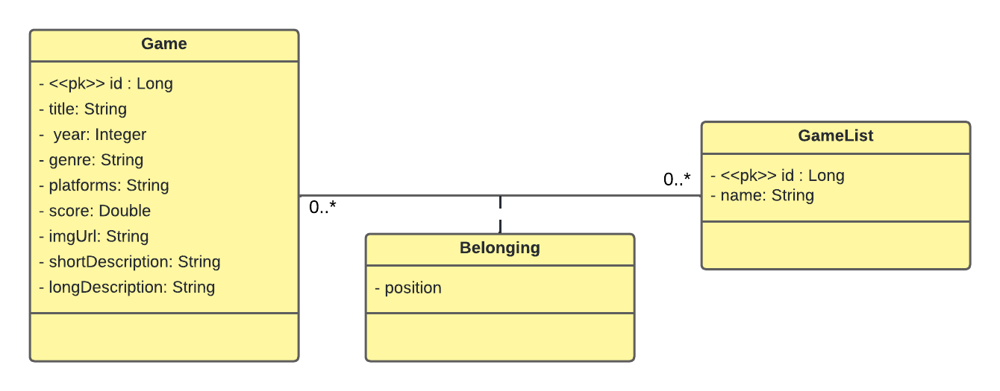

# Dslist - lista de jogos
O projeto foi desenvolvido no intensivão java spring da [devsuperior](https://github.com/devsuperior), ele é um projeto backend que fornece endpoints para recuperar as listas de jogos, os jogos e reorganizar a posição dos jogos na lista a que pertence.

## Tecnologias utilizadas
- Java
- Spring-boot
- Banco de dados H2
- Banco de dados Postgresql
- Docker

## Testar na sua máquina
clone o repositório
```bash
git clone https://github.com/Lidianacosta/dslist.git
```
Rode a aplicação
```bash
mvn spring-boot:run
```

## Diagrama de classes
